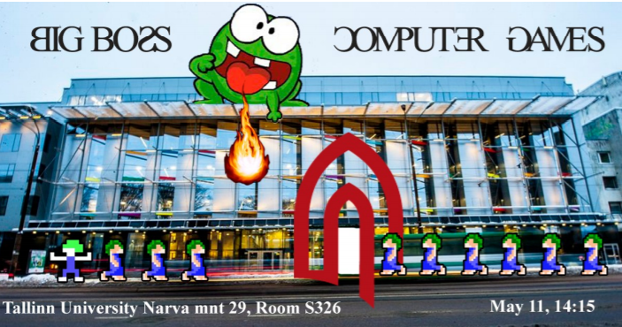

# Big-Boss-Advergame
This is a game like a Google banner – it looks like an ad (with an event name and dates and
location) but when you click on it, it turns to be minimalistic interactive game.
The purpose of this game is to advertise DLG public events like final thesis defence or presentation
of other study results (e.g. exam of the Computer Games course).
10? students (NPC’s) try to enter to the TLÜ (Terra or Astra building) - in the first round (level 1)
they walk in a row like lemmings.
Teacher (a monster on the roof of the university building) tries to stop students by spitting fire balls
on them. The size and the damage of the fireball depends on the delay time (the more frequently the
monster is spitting the smaller the fireball is - destroys only one student).
Students who get a hit will run away (they don’t die)
If all students get in, the game is over and player will get the feedback
</img>

Big Boss Advergame on reklaammäng mis enne peale klikkimist näeb välja nagu lihtne banner. Mängu eesmärgiks on reklaamida erinevaid DLG üritusi. 10 õpilast proovivad siseneda Astra õppehoonesse ning katusel olev koll ehk õppejõud üritab õpilasi takistada tulistades nende poole tulepalle. Pihta saanud õpilased mitte ei sure ära vaid jooksevad eemale. Kui kõik õpilased on õppehoonesse sisse pääsenud, antakse mängijale tagasiside selle kohta, kui range või leebe ta õpilaste suhtes on.

## Õpime Tallinna Ülikoolis Digitehnoloogiate instituudis ning see projekt on tehtud tarkvaraarenduse praktika aine raames.

## Kasutatud tehnoloogiad
Photoshop CC 2015, Adobe Illustrator CC 2015,

## Meeskonna liikmed
Kaspar Rasmus Eelmaa, Kent Pirma, Rando Talviste, Karl-Daniel tarkvaraarenduse

## Kasutusjuhend
Mängu mängimiseks tuleb vajutada bännerile, mis avab mängu suuremas aknas. Kolli kontrollimiseks on vajalik klaviatuur.

## Paigaldusjuhend

## Litsents
