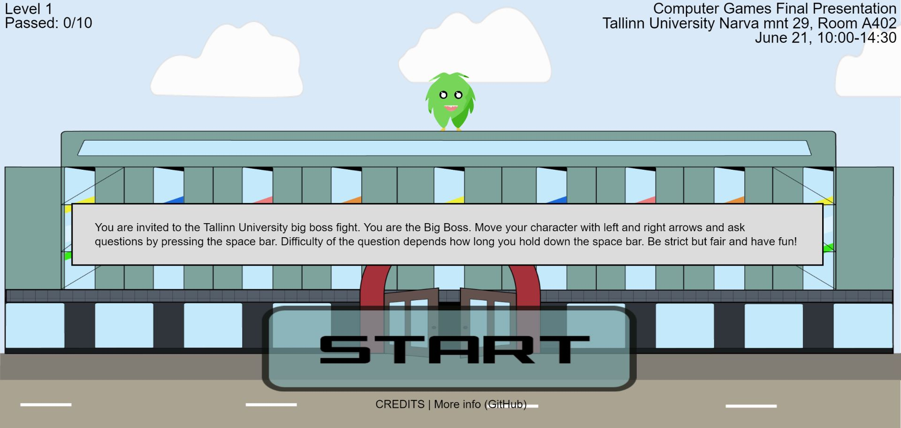
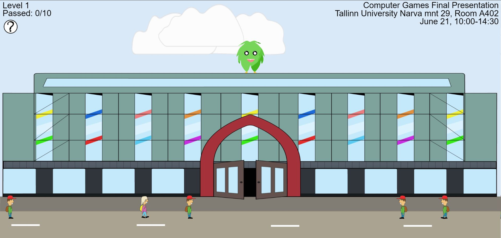
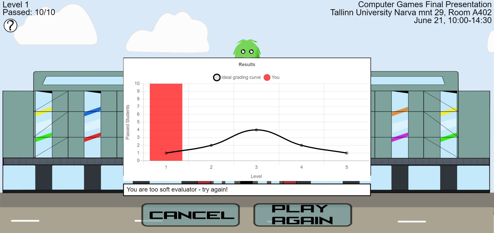

# Big-Boss-Advergame

</img>

Mängu eesmärgiks on reklaamida erinevaid DLG üritusi. 10 õpilast proovivad siseneda Astra õppehoonesse ning katusel olev koll ehk õppejõud üritab õpilasi takistada küsides nende käest raskeid küsimusi. Õpilased, kes ei oska vastata jooksevad eemale, et hiljem uuesti proovida. Kui kõik õpilased on õppehoonesse sisse pääsenud, antakse mängijale tagasiside selle kohta, kui range või leebe ta õpilaste suhtes on.

## Õpime Tallinna Ülikoolis Digitehnoloogiate instituudis ning see projekt on tehtud tarkvaraarenduse praktika aine raames.

## Kasutatud tehnoloogiad
HTML 5
CSS 3
JavaScript
JSON
p5.js 0.8.0
p5.js 0.7.2
chart.js 2.8.0
JQuery 3.4.0

## Meeskonna liikmed
Juhendaja: Martin Sillaots
 
Grupi liikmed: Kaspar Rasmus Eelmaa, Kent Pirma, Rando Talviste, Karl-Daniel Karu

## Kasutusjuhend
Mängu mängimiseks tuleb vajutada start nupule, millele vajutades mäng käivitub. Kolli liikumise kontrollimine toimub nooleklahvidega ning tulekera tulistamine tühikuga. Kui kõik üliõpilased on jõudnud kooli või on ära aetud, siis mäng saab läbi ning kuvatakse tagasiside.

</img>

</img>

</img>

## Paigaldusjuhend
Mängu paigaldamiseks tuleb võtta kaust SOURCE CODE ning paigutada selle sisu domeenile. Mäng hakkab siis kohe tööle, sest pole vaja erinevad andmetabeleid. Et muuta kuvatavat teksti ürituse kohta, siis tuleb muuta faili nimega "eventData.json". Failis on neli erinevat elementi ning esimesed kolm kuvatakse avalehel (ürituse nimi, asukoht ning toimumisaeg) ning link(lehekülg, mida kuvatakse väiksena) on kuvatud kutsena cancel nuppu vajutades.

## Litsents

https://github.com/rasmus127/Big-Boss-Advergame/blob/master/license.txt
